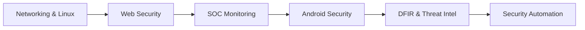

<div align="center">


<br>

# Hi, I'm Darma 👋

**Cyber Security Learner • SOC Enthusiast • Web & Mobile Security Researcher**

`always learning` • `always building` • `always improving`

<br>

[](#)
[](#)
[](#)
[](#)
[](#)

</div>

---

## 👤 About Me

I'm a fresh graduate in Informatics with a strong interest in **Cyber Security**, especially around **SOC operations, web application security, Android/mobile security, Linux, networking, and security automation**.

I like learning by building practical labs, testing vulnerable environments, writing notes, and turning my learning process into GitHub repositories.

---

## 🛠 What I Do

| Area | Focus |
|---|---|
| 🛡️ **SOC Operations** | SIEM, Wazuh, Sysmon, alert triage, log analysis, incident handling basics |
| 🌐 **Web Security** | OWASP Top 10, recon, vulnerability testing, Burp Suite, reporting |
| 📱 **Mobile Security** | Android APK analysis, JADX, Apktool, Frida, adb, mobile API testing |
| 🕸️ **Network Security** | TCP/IP, DNS, HTTP, Nmap, Wireshark, troubleshooting |
| 🐞 **Bug Bounty & VAPT** | Recon, methodology, checklist-based testing, vulnerability reporting |
| 🧪 **Security Research** | CVE/PoC study, malware analysis basics, threat intelligence notes |

---

## 🧰 Tools & Technologies

<div align="center">

### Security


### Development & Lab


</div>

---

## 🚀 Featured Projects

| Project | Description |
|---|---|
| **SOC Monitoring Lab** | Security monitoring lab with Wazuh, Windows endpoint logs, Sysmon, and alert investigation workflow. |
| **Security Monitoring Platform** | Web-based monitoring project using Wazuh, n8n, PostgreSQL, Redis, Docker, and dashboard/reporting features. |
| **Pentest Toolkit** | Curated cybersecurity tools grouped by Web, Android, Cloud, Internal, OSINT, AI Security, DFIR, and Learning Resources. |
| **Android Security Lab** | Android reverse engineering and mobile app testing practice using JADX, Apktool, Frida, adb, and emulator labs. |
| **Cyber Security Learning Resources** | Organized learning resources for Web Security, SOC, DFIR, Mobile Security, Malware Analysis, and CTF practice. |

---

## 📚 Currently Learning

```text
SOC Analyst Workflow
├── SIEM / Wazuh
├── Windows Event Logs
├── Sysmon Detection
├── Alert Triage
└── Incident Handling Basics

Offensive Security
├── Web Application Pentesting
├── Android Application Security
├── Vulnerability Assessment
└── Security Reporting

Research
├── Malware Analysis Basics
├── Reverse Engineering Basics
├── Threat Intelligence
└── Cloud & Infrastructure Security
```

---

## 📊 GitHub Stats

<div align="center">


<br><br>


<br><br>


</div>

> Note: GitHub stats images sometimes fail to load because of third-party API rate limits. The profile will still work normally.

---

## 🧭 Learning Roadmap

<div align="center">



</div>

---

## 🤝 Connect With Me

<div align="center">

[](https://linkedin.com/in/inyomandarmayoga)
[](https://github.com/darmayo)
[](https://medium.com/@darmayo)


</div>

---

<div align="center">

**Always learning. Always building. Always improving.**


</div>
